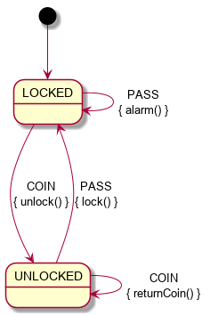

# Kotlin Finite-state machine

This is a small implementation of an FSM in Kotlin.

## Getting Started



The state machine implementation supports events triggering transitions from one state to another while performing an optional action as well as entry and exit actions. 

## Features
* Event driven state machine.
* External and internal transitions 
* State entty and exit actions.
* Default state actions.
* Default entry and exit actions.

## Todo
[ ] Multiple state maps
[ ] Push / pop transitions

## Resources
* [Documentation](https://open.jumpco.io/projects/kfsm/index.html)
* [API Docs](https://open.jumpco.io/projects/kfsm/javadoc/kfsm/index.html)
* [Sample Project](https://github.com/open-jumpco/kfsm-samples)

## Dependency 

KFSM is a multiplatform project and relies on kotlin stdlib only.
Add the relevant dependency to your build file.

### Kotlin/JVM Projects
```groovy
dependencies {
    implementation 'io.jumpco.open:kfsm-jvm:0.7.1'
}
```
### KotlinJS Projects
```groovy
dependencies {
    implementation 'io.jumpco.open:kfsm-js:0.7.1'
}
```
### Kotlin/Native Projects using LinuxX64
```groovy
dependencies {
    implementation 'io.jumpco.open:kfsm-linuxX64:0.7.1'    
}
```
### Kotlin/Native Projects using MinGW64
```groovy
dependencies {
    implementation 'io.jumpco.open:kfsm-mingwX64:0.7.1'    
}
```
### Kotlin/Native Projects using macOS
```groovy
dependencies {
    implementation 'io.jumpco.open:kfsm-macosX64:0.7.1'    
}
```


## Questions:
* Should entry / exit actions receive state or event as arguments?
* Should default actions receive state or event as arguments?
* Is there a more elegant way to define States and Events using sealed classes?
* Would support for multiple named state maps be useful? 
* Push / Pop into named map with pop providing optional new state?
* Are any features missing from the implementation?

