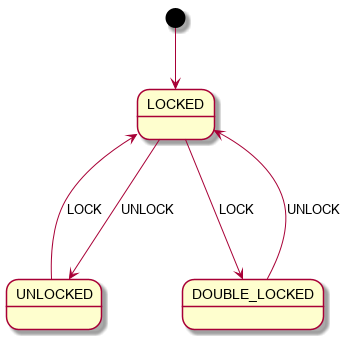

# Kotlin Finite-state machine

This is a small implementation of an FSM in Kotlin.
This model supports events that trigger may cause a transition from one state to another while performing an optional action.

Assume we and to manage the state on a simple lock.
We want to ensure that the `lock()` function is only called when the lock is not locked and we want `unlock()` to be called when locked.

```kotlin
class Lock {
    var locked: Int = 0
        private set

    fun lock() {
        assert(locked == 0)
        println("Lock")
        locked += 1
    }

    fun doubleLock() {
        assert(locked == 1)        
        println("DoubleLock")
        locked += 1
    }

    fun unlock() {
        assert(locked == 1)
        println("Unlock")
        locked -= 1
    }
    fun doubleUnlock() {
        assert(locked == 2)
        println("DoubleUnlock")
        locked -= 1
    }
}
```
We declare 2 enums, one for the possible states and one for the possible events.
For the sake of testing more than 2 states we are simulating double-locking.

```kotlin
enum class LockStates {
    LOCKED,
    DOUBLE_LOCKED,
    UNLOCKED
}

enum class LockEvents {
    LOCK,
    UNLOCK
}
```

Then we use the DSL to declare a definition of a statemachine matching the diagram:



```kotlin
val definition = StateMachine<LockStates, LockEvents, Lock>().dsl {
    initial { context ->
        when (context.locked) {
            0 -> UNLOCKED
            1 -> LOCKED
            2 -> DOUBLE_LOCKED
            else -> error("Invalid state locked=${it.locked}")
        }
    }
    event(UNLOCK) {
        state(LOCKED to UNLOCKED) { context ->
            context.unlock()
        }
        state(DOUBLE_LOCKED to LOCKED) { context ->
            context.doubleUnlock()
        }
        state(UNLOCKED) {
            error("Already Unlocked")
        }
    }
    event(LOCK) {
        state(UNLOCKED to LOCKED) { context ->
            context.lock()
        }
        state(LOCKED to DOUBLE_LOCKED) { context ->
            context.doubleLock()
        }
        state(DOUBLE_LOCKED) {
            error("Already Double Locked")
        }
    }
}.build()
```

With this We are saying:
On an event UNLOCK when the state is LOCKED transition to UNLOCKED and execute the code in the lambda 

In the case where we use `state(UNLOCKED) {` we are saying when the state is UNLOCKED perform the action without changing the end state.

Then we instantiate the FSM and provide a context to operate on:

```kotlin
val lock = Lock()
val fsm = definition.instance(lock)
```

Now we have a context that is independent of the FSM. 

Sending events may invoke actions:
```kotlin
// State state is LOCKED
fsm.event(LOCK)
// Expect DoubleLock and end state is DOUBLE_LOCKED
fsm.event(UNLOCK)
// Expect DoubleUnlock and end state is LOCKED
fsm.event(UNLOCK)
// Expect Unlock and end state is UNLOCKED
```
