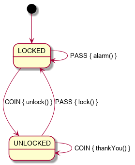

# Kotlin Finite-state machine

This is a small implementation of an FSM in Kotlin.
This model supports events that trigger may cause a transition from one state to another while performing an optional action.

Assume we and to manage the state on a simple lock.
We want to ensure that the `lock()` function is only called when the lock is not locked and we want `unlock()` to be called when locked.

http://smc.sourceforge.net/slides/SMC_Tutorial.pdf

```kotlin
class Turnstile(var locked: Boolean = true) {
    fun unlock() {
        assert(locked) { "Cannot unlock when not locked" }
        println("Unlock")
        locked = false
    }

    fun lock() {
        assert(!locked) { "Cannot lock when locked" }
        println("Lock")
        locked = true
    }

    fun alarm() {
        println("Alarm")
    }

    fun thankYou() {
        println("Thank You")
    }
}
```
We declare 2 enums, one for the possible states and one for the possible events.

```kotlin
enum class TurnstileStates {
    LOCKED,
    UNLOCKED
}

enum class TurnstileEvents {
    COIN,
    PASS
}
```

Then we use the DSL to declare a definition of a statemachine matching the diagram:



```kotlin
val definition = StateMachine<TurnstileStates, TurnstileEvents, Turnstile>().dsl {
    initial { ts ->
        when (ts.locked) {
            true -> TurnstileStates.LOCKED
            false -> TurnstileStates.UNLOCKED
        }
    }
    state(TurnstileStates.LOCKED) {
        event(TurnstileEvents.COIN to TurnstileStates.UNLOCKED) { ts ->
            ts.unlock()
        }
        event(TurnstileEvents.PASS) { ts ->
            ts.alarm()
        }
    }
    state(TurnstileStates.UNLOCKED) {
        event(TurnstileEvents.COIN) { ts ->
            ts.thankYou()
        }
        event(TurnstileEvents.PASS to TurnstileStates.LOCKED) { ts ->
            ts.lock();
        }
    }
}.build()
```

With this We are saying:
On an event COIN when the state is LOCKED transition to UNLOCKED and execute the code in the lambda `{ ts -> ts.unlock() }`

In the case where we use `state(UNLOCKED) {` we are saying when the state is UNLOCKED perform the action without changing the end state.

Then we instantiate the FSM and provide a context to operate on:

```kotlin
val turnstile = Turnstile()
val fsm = definition.instance(turnstile)
```
Now we have a context that is independent of the FSM. 

Sending events may invoke actions:
```kotlin
// State state is LOCKED
fsm.event(COIN)
// Expect unlock action end state is UNLOCKED
fsm.event(PASS)
// Expect lock() action and end state is LOCKED
fsm.event(PASS)
// Expect alarm() action and end state is LOCKED
fsm.event(COIN)
// Expect unlock() and end state is UNLOCKED
fsm.event(COIN)
// Expect thankYou() and end state is UNLOCKED
```
